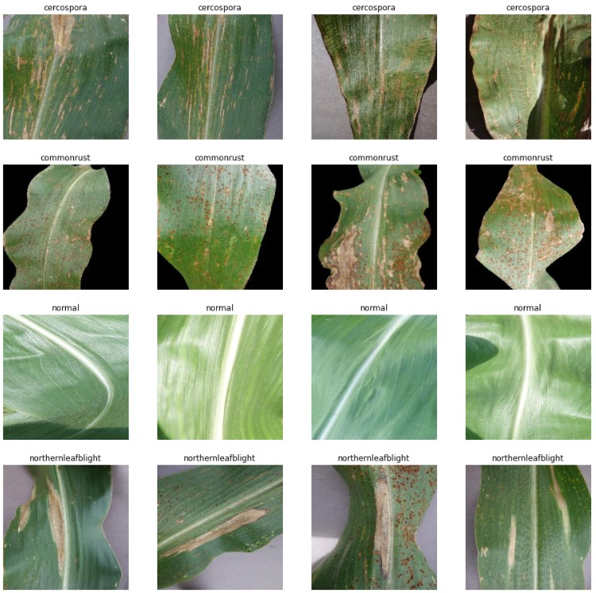

# Klasifikasi Penyakit Daun Pada Tumbuhan Jagung

## Deskripsi Dataset 

Dalam penyusunan project ini menggunakan dataset yang berasal dari kaggle
Dataset pertama berasal dari penelitian Tulin Otzurk, dkk yang berjudul [Convolutional neural network for maize leaf disease image classification](http://journal.uad.ac.id/index.php/TELKOMNIKA/article/view/14840)
Dataset memiliki jumlah total sebanyak 2000 image yang terdiri atas 4 kelas dengan rincian :
1. healthy : 500
2. Cercospora : 500
3. common rust : 500
4. northern leaf blight : 500
dataset : https://www.kaggle.com/abdallahalidev/plantvillage-dataset

### Jurnal referensi 

[Convolutional neural network for maize leaf disease image classification](http://journal.uad.ac.id/index.php/TELKOMNIKA/article/view/14840)

## Dataset Overview

Splitting Dataset 80% 19% 1%

 

### Proses Pengerjaan

1. Balancing Data   *done*
2. Preprocessing    *done*
3. Modelling        *done*
4. Augmentation     *done*
5. Hparam           *done*
>minus save model   *on going*
6. Pretrain model   *on going*

## Modul
- [Modul 2](https://github.com/nicoyogis/Praktikum-PM/blob/main/code%20fix/modelling.ipynb)
- [Modul 3](https://github.com/nicoyogis/Praktikum-PM/blob/main/code%20fix/augmentasi_mod3.ipynb)
- [Modul 4](https://github.com/nicoyogis/Praktikum-PM/blob/main/code%20fix/modelling.ipynb)
- [Modul 5](*on going*)

## Authors

Kontributor dalam projek ini yaitu :
* Nico Yogi Syahputro
* Indah Rezki Ananda

## Acknowledgments

Inspiration, code snippets, etc.

